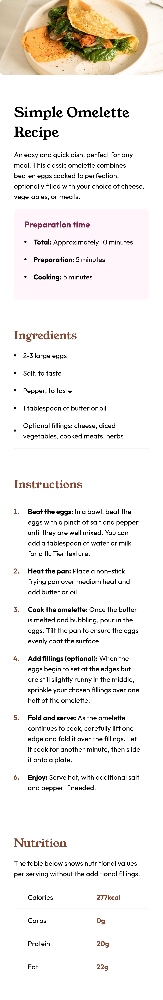
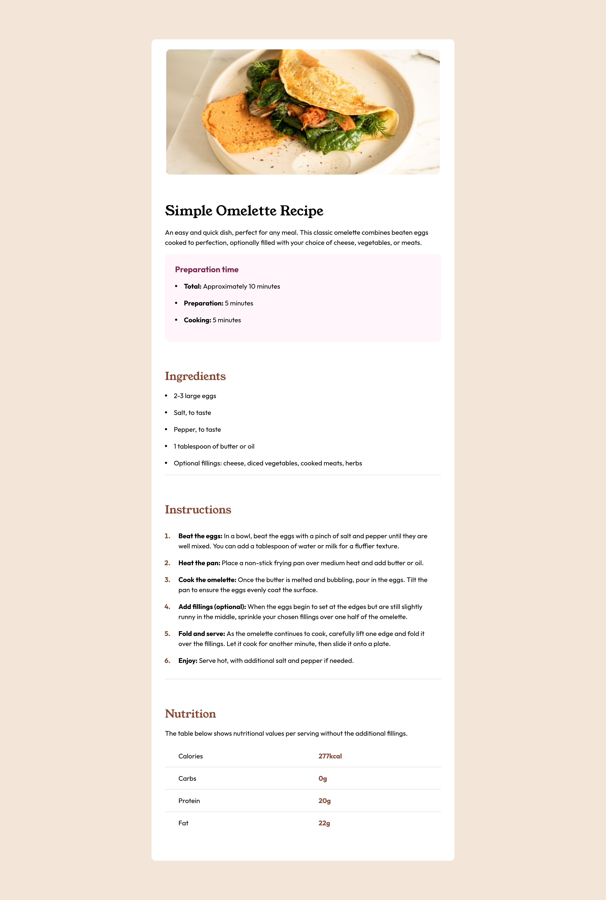

# Frontend Mentor - Recipe page solution

This is a solution to the [Recipe page challenge on Frontend Mentor](https://www.frontendmentor.io/challenges/recipe-page-KiTsR8QQKm). Frontend Mentor challenges help you improve your coding skills by building realistic projects. 

## Table of contents

- [Overview](#overview)
  - [The challenge](#the-challenge)
  - [Screenshot](#screenshot)
  - [Links](#links)
- [My process](#my-process)
  - [Built with](#built-with)
  - [What I learned](#what-i-learned)
- [Author](#author)

## Overview

### The challenge

- Adjusting the image width properly.
- Vertically align the bullets with the content of the list item (unsorted list).
- Stylling the table.

### Screenshot

### Links

- Solution URL: [Github repo](https://github.com/IbrahimMurad/recipe-page)
- Live Site URL: [Live site](https://ibrahimmurad.github.io/recipe-page/)

## My process

### Built with

- Semantic HTML5 markup
- CSS custom properties
- Flexbox
- CSS Grid

### What I learned

- Table rows `<tr>` does not support borders, margin or padding. I use them with `<td>`.
- Using min-width and max-width is better for responsive designs.
- markers are not really customizable, it needs to be overridden by before to have full control. 

## Author

- Website - [Github](https://github.com/ibrahimmurad/)
- Frontend Mentor - [@IbrahimMurad](https://www.frontendmentor.io/profile/IbrahimMurad)